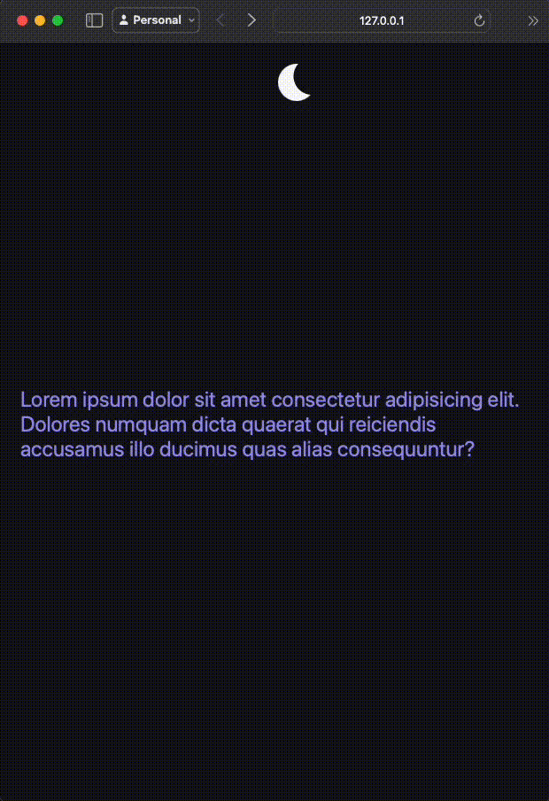

## theme-switcher

This app allows users to toggle between light and dark themes. The theme switcher is represented by a sun and moon icon, which changes appearance based on the selected theme. Works clean and is easy to use.

User preference is stored in localStorage and matches the system setting as demonstrated below! 



# Prerequisites
Web browser that supports CSS variables and the :is() pseudo-class function.

# Installing

git clone the repository to your local machine:

```
git clone https://github.com/username/project.git
```

# License
This project is licensed under the MIT License - see the LICENSE.md file for details.
